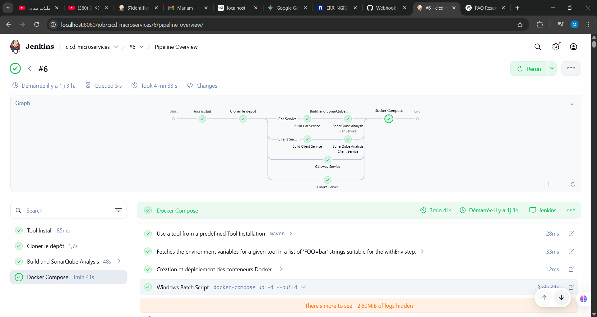
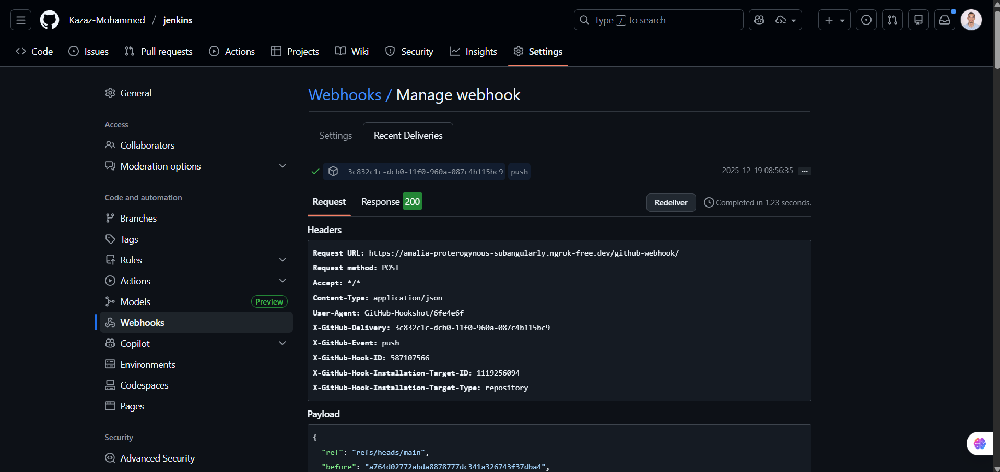

# CI/CD Pipeline avec Jenkins pour Microservices

Ce projet implémente un pipeline CI/CD complet utilisant Jenkins pour automatiser le build, l'analyse de code (SonarQube) et le déploiement de microservices Spring Boot.

## 📋 Table des matières

- [Vue d'ensemble](#vue-densemble)
- [Architecture](#architecture)
- [Prérequis](#prérequis)
- [Installation et Configuration](#installation-et-configuration)
- [Pipeline Jenkins](#pipeline-jenkins)
- [Utilisation](#utilisation)
- [Dépannage](#dépannage)

## 🎯 Vue d'ensemble

Ce projet démontre la mise en place d'un pipeline CI/CD complet pour une architecture microservices comprenant :

- **CI (Continuous Integration)** : Compilation automatique avec Maven et analyse de qualité de code avec SonarQube
- **CD (Continuous Deployment)** : Déploiement automatique des services dans des conteneurs Docker via Docker Compose
- **Automatisation** : Déclenchement automatique du pipeline à chaque push GitHub via webhooks

### Objectifs pédagogiques

- Mettre en place Jenkins et configurer les outils (JDK, Maven, SonarScanner)
- Déployer SonarQube via Docker Compose et créer des projets + tokens par microservice
- Exposer Jenkins avec Ngrok et brancher GitHub via webhooks
- Créer un job Pipeline Jenkins et écrire un script de pipeline multi-stages
- Lancer/valider l'exécution (Jenkins, SonarQube, Docker) et vérifier le déclenchement par push

## 🏗️ Architecture

L'application est composée de **4 microservices** :

1. **`car`** (Service Voiture) - Port 8089
   - Gestion des voitures
   - Analyse SonarQube activée

2. **`client`** (Service Client) - Port 8088
   - Gestion des clients
   - Analyse SonarQube activée

3. **`gateway`** (API Gateway) - Port 8888
   - Point d'entrée unique pour tous les services
   - Routage et load balancing

4. **`server_eureka`** (Eureka Server) - Port 8761
   - Service de découverte et enregistrement des microservices

### Infrastructure

- **MySQL** : Base de données pour les services
- **Consul** : Service discovery et configuration
- **Docker Compose** : Orchestration des conteneurs (dossier `deploy/`)

## 📦 Prérequis

### Outils techniques

- **JDK 17** (ou version compatible) + variable d'environnement `JAVA_HOME`
- **Maven** (installé localement ou géré par Jenkins)
- **Git** (ligne de commande)
- **Docker** + **Docker Compose**
- **Jenkins** (installation locale)
- **SonarQube** (déployé via Docker Compose) + PostgreSQL
- **Ngrok** (compte + authtoken)
- **Compte GitHub** (accès au dépôt du projet)

### Connaissances requises

- Git : clone, commit, push, notion de webhook
- Java/Spring Boot : structure d'un projet, build Maven
- Notions CI/CD : stages (build, analyse, déploiement), exécution automatique

## 🚀 Installation et Configuration

### Étape 1 : Récupération du projet

```bash
git clone https://github.com/Kazaz-Mohammed/jenkins.git
cd jenkins
```

### Étape 2 : Installation et configuration de Jenkins

#### 2.1 Installer Jenkins

Télécharger et installer Jenkins depuis [jenkins.io](https://www.jenkins.io/download/)

#### 2.2 Configuration initiale

- **Type de service** : Sélectionner `LocalSystem` (permet à Jenkins d'accéder à Docker)
- **Port** : Choisir un port (par défaut 8080) et tester
- **Chemin JDK** : Indiquer le chemin local du JDK 17 (ex: `C:\Program Files\Java\jdk-17`)

#### 2.3 Configurer Maven dans Jenkins

1. Aller dans **Manage Jenkins** → **Tools**
2. Section **Maven** → **Add Maven**
3. Nom : `maven` (important : doit correspondre au nom dans le pipeline)
4. Choisir "Install automatically" ou indiquer le chemin local

#### 2.4 Configurer SonarScanner dans Jenkins

1. **Manage Jenkins** → **Tools**
2. Section **SonarQube Scanner** → **Add SonarQube Scanner**
3. Installer automatiquement ou indiquer le chemin

### Étape 3 : Installation et configuration de SonarQube

#### 3.1 Démarrer SonarQube avec Docker Compose

Le fichier `sonarqube-compose.yml` est déjà présent dans le projet :

```bash
docker compose -f sonarqube-compose.yml up -d
docker ps
```

SonarQube sera accessible sur **http://localhost:9999**

#### 3.2 Créer les projets SonarQube et générer les tokens

1. Accéder à SonarQube : http://localhost:9999
2. Se connecter (login par défaut : `admin` / `admin`)
3. Créer deux projets :
   - **Projet `car`** → Générer un token
   - **Projet `client`** → Générer un token
4. **Sauvegarder les tokens** (ils seront utilisés dans Jenkins)

#### 3.3 Déclarer les serveurs SonarQube dans Jenkins

1. **Manage Jenkins** → **System**
2. Section **SonarQube servers** → **Add SonarQube**
3. Créer deux configurations :

   **Configuration 1 :**
   - Name : `SonarQube-Car`
   - Server URL : `http://localhost:9999`
   - Server authentication token : token du projet `car`

   **Configuration 2 :**
   - Name : `SonarQube-Client`
   - Server URL : `http://localhost:9999`
   - Server authentication token : token du projet `client`

> ⚠️ **Important** : Les noms `SonarQube-Car` et `SonarQube-Client` doivent correspondre exactement à ceux utilisés dans le pipeline.

### Étape 4 : Exposition de Jenkins via Ngrok et configuration des Webhooks GitHub

#### 4.1 Installer Ngrok et associer un authtoken

```bash
ngrok config add-authtoken <votre-token>
```

#### 4.2 Lancer un tunnel HTTP vers Jenkins

```bash
ngrok http http://localhost:8080
```

> Note : Si Jenkins utilise un autre port, remplacer `8080` par le port approprié.

#### 4.3 Copier l'URL publique Ngrok

Ngrok affichera une URL du type : `https://xxxx.ngrok-free.app`

> ⚠️ **Important** : Cette URL change à chaque redémarrage de Ngrok (plan gratuit). Il faudra mettre à jour le webhook GitHub si l'URL change.

#### 4.4 Déclarer l'URL du dépôt GitHub dans Jenkins

1. **Manage Jenkins** → **System**
2. Section **GitHub** → **GitHub Pull Requests** ou **Published Jenkins URL**
3. Ajouter l'URL du projet : `https://github.com/Kazaz-Mohammed/jenkins/`

#### 4.5 Créer un Webhook GitHub pointant vers Jenkins

1. Sur GitHub : **Settings** → **Webhooks** → **Add webhook**
2. Remplir :
   - **Payload URL** : `https://<URL_NGROK>/github-webhook/`
   - **Content type** : `application/json`
   - **Which events** : "Just the push event"
   - **Active** : ✓
3. Cliquer sur **Add webhook**

> 💡 Vérifier le statut du webhook dans l'onglet "Recent Deliveries" (code 200 = succès)

### Étape 5 : Création du Job Pipeline Jenkins

#### 5.1 Créer un nouveau job "Pipeline"

1. **Dashboard** → **New Item**
2. Nom : `cicd-microservices` (ou autre nom explicite)
3. Type : **Pipeline**
4. Cliquer sur **OK**

#### 5.2 Configurer le job

1. **GitHub project** : Cocher et ajouter l'URL `https://github.com/Kazaz-Mohammed/jenkins/`
2. **Build Triggers** : Cocher **GitHub hook trigger for GITScm polling**
3. **Pipeline** → **Definition** : Sélectionner **Pipeline script**
4. Coller le script de pipeline (voir section suivante)

## 🔄 Pipeline Jenkins

### Vue d'ensemble du pipeline

Le pipeline Jenkins exécute les étapes suivantes :

1. **Cloner le dépôt** : Récupération du code depuis GitHub
2. **Build and SonarQube Analysis** (en parallèle) :
   - Build et analyse SonarQube pour `car`
   - Build et analyse SonarQube pour `client`
   - Build pour `gateway`
   - Build pour `server_eureka`
3. **Docker Compose** : Déploiement des services dans des conteneurs



### Script de pipeline

```groovy
pipeline {
    agent any

    tools {
        maven 'maven'
    }

    stages {

        stage('Cloner le dépôt') {
            steps {
                echo 'Clonage du dépôt GitHub...'
                git branch: 'main', url: 'https://github.com/Kazaz-Mohammed/jenkins.git'
            }
        }

        stage('Build and SonarQube Analysis') {
            parallel {

                stage('Car Service') {
                    stages {

                        stage('Build Car Service') {
                            steps {
                                dir('car') {
                                    echo 'Compilation et génération du service Car...'
                                    script {
                                        bat 'mvn clean install -DskipTests'
                                    }
                                }
                            }
                        }

                        stage('SonarQube Analysis Car Service') {
                            steps {
                                dir('car') {
                                    script {
                                        def mvn = tool 'maven';
                                        withSonarQubeEnv('SonarQube-Car') {
                                            bat "${mvn}\\bin\\mvn clean verify ^ " +
                                                "sonar:sonar ^ " +
                                                "-Dsonar.projectKey=car ^ " +
                                                "-Dsonar.projectName='car' ^ " +
                                                "-DskipTests"
                                        }
                                    }
                                }
                            }
                        }
                    }
                }

                stage('Client Service') {
                    stages {

                        stage('Build Client Service') {
                            steps {
                                dir('client') {
                                    echo 'Compilation et génération du service Client...'
                                    script {
                                        bat 'mvn clean install -DskipTests'
                                    }
                                }
                            }
                        }

                        stage('SonarQube Analysis Client Service') {
                            steps {
                                dir('client') {
                                    script {
                                        def mvn = tool 'maven';
                                        withSonarQubeEnv('SonarQube-Client') {
                                            bat "${mvn}\\bin\\mvn clean verify ^ " +
                                                "sonar:sonar ^ " +
                                                "-Dsonar.projectKey=client ^ " +
                                                "-Dsonar.projectName='client' ^ " +
                                                "-DskipTests"
                                        }
                                    }
                                }
                            }
                        }
                    }
                }

                stage('Gateway Service') {
                    steps {
                        dir('gateway') {
                            echo 'Compilation et génération du service Gateway...'
                            script {
                                bat 'mvn clean install -DskipTests'
                            }
                        }
                    }
                }

                stage('Eureka Server') {
                    steps {
                        dir('server_eureka') {
                            echo 'Compilation et génération du serveur Eureka...'
                            script {
                                bat 'mvn clean install -DskipTests'
                            }
                        }
                    }
                }
            }
        }

        stage('Docker Compose') {
            steps {
                dir('deploy') {
                    echo 'Création et déploiement des conteneurs Docker...'
                    script {
                        bat 'docker-compose up -d --build'
                    }
                }
            }
        }
    }
}
```

### Explication des stages

- **`tools { maven 'maven' }`** : Utilise l'installation Maven déclarée dans Jenkins
- **`stage('Cloner le dépôt')`** : Récupère la branche `main` du dépôt GitHub
- **`parallel { ... }`** : Exécute plusieurs builds/analyses en parallèle pour optimiser le temps d'exécution
- **`withSonarQubeEnv('SonarQube-Car')`** : Injecte l'URL + token SonarQube configurés dans Jenkins
- **`docker-compose up -d --build`** : Rebuild et redémarre les services conteneurisés depuis le dossier `deploy/`

> 📝 **Note** : Le script utilise `bat` pour Windows. Sur Linux, remplacer `bat` par `sh` et adapter les chemins.

## 🎮 Utilisation

### Lancer un build manuel

1. Dans Jenkins : Ouvrir le job → **Build Now**
2. Suivre l'exécution dans **Console Output**

### Vérifier les résultats

#### Dans Jenkins

- Ouvrir **Console Output** et vérifier :
  - ✅ Clonage du dépôt
  - ✅ Builds Maven réussis (car, client, gateway, server_eureka)
  - ✅ Analyses SonarQube exécutées (car et client)
  - ✅ Docker Compose déployé

#### Dans SonarQube

1. Accéder à http://localhost:9999
2. Ouvrir le projet **car** → Vérifier qu'une analyse récente existe
3. Ouvrir le projet **client** → Vérifier idem
4. Consulter les métriques : bugs, vulnérabilités, code smells

#### Vérifier le déploiement Docker

```bash
docker ps
```

Les conteneurs suivants devraient être démarrés :
- `mysql-container1`
- `consul-container`
- `eureka-server`
- `gateway-service`
- `client-service`
- `voiture-service`
- `phpmyadmin-container`

### Tester le déclenchement automatique via push GitHub

1. Faire une modification (ex: README.md)
2. Commit et push :

```bash
git add README.md
git commit -m "test: déclenchement webhook"
git push
```

3. Vérifier dans Jenkins qu'un nouveau build démarre automatiquement



## 🔧 Dépannage

### Problèmes courants

#### Jenkins ne se lance pas
- **Cause** : Port occupé
- **Solution** : Changer le port dans la configuration Jenkins (ex: 8081)

#### SonarQube inaccessible
- **Cause** : Conteneurs non démarrés
- **Solution** : Vérifier `docker ps` et relancer `docker compose -f sonarqube-compose.yml up -d`

#### Analyse SonarQube échoue
- **Cause** : Nom `withSonarQubeEnv('...')` ne correspond pas au nom déclaré dans Jenkins System
- **Solution** : Vérifier que les noms sont identiques (`SonarQube-Car` et `SonarQube-Client`)

#### Webhook GitHub "failed"
- **Cause** : URL Ngrok changée ou incorrecte
- **Solution** : Mettre à jour le **Payload URL** dans GitHub Webhooks avec la nouvelle URL Ngrok

#### Docker Compose échoue dans Jenkins
- **Cause** : Jenkins n'a pas accès au daemon Docker
- **Solution** : Vérifier que Jenkins s'exécute avec un utilisateur ayant accès à Docker, ou exécuter Jenkins en tant que service avec les permissions appropriées

#### Maven non trouvé
- **Cause** : Nom de l'installation Maven ne correspond pas
- **Solution** : Vérifier que l'installation Maven dans Jenkins s'appelle exactement `maven`

#### Erreur "Java not found" / "JAVA_HOME"
- **Cause** : Chemin JDK incorrect dans Jenkins
- **Solution** : Vérifier le chemin JDK dans **Manage Jenkins** → **System** → **Global properties** → **Environment variables**

## 📚 Ressources

- [Documentation Jenkins](https://www.jenkins.io/doc/)
- [Documentation SonarQube](https://docs.sonarqube.org/)
- [Documentation Ngrok](https://ngrok.com/docs)
- [Dépôt GitHub](https://github.com/Kazaz-Mohammed/jenkins)

## 📝 Notes

- Le pipeline analyse actuellement les services `car` et `client` avec SonarQube. Pour ajouter l'analyse pour `gateway` et `server_eureka`, dupliquer le modèle "car/client" avec des `projectKey` distincts.
- Sur Linux, remplacer `bat` par `sh` dans le script de pipeline et adapter les chemins.
- L'URL Ngrok change à chaque redémarrage (plan gratuit). Penser à mettre à jour le webhook GitHub si nécessaire.

---

**Auteur** : Kazaz Mohammed  
**Dépôt** : https://github.com/Kazaz-Mohammed/jenkins
